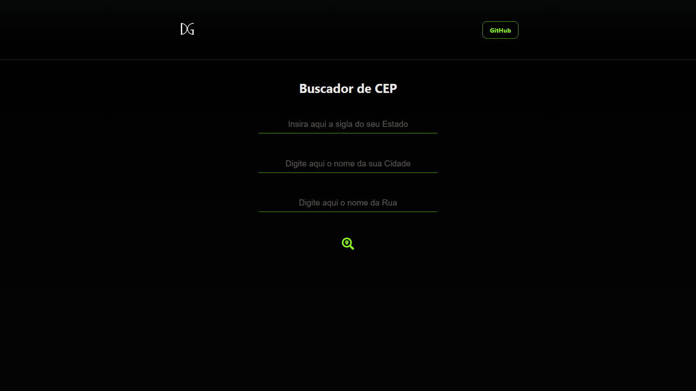
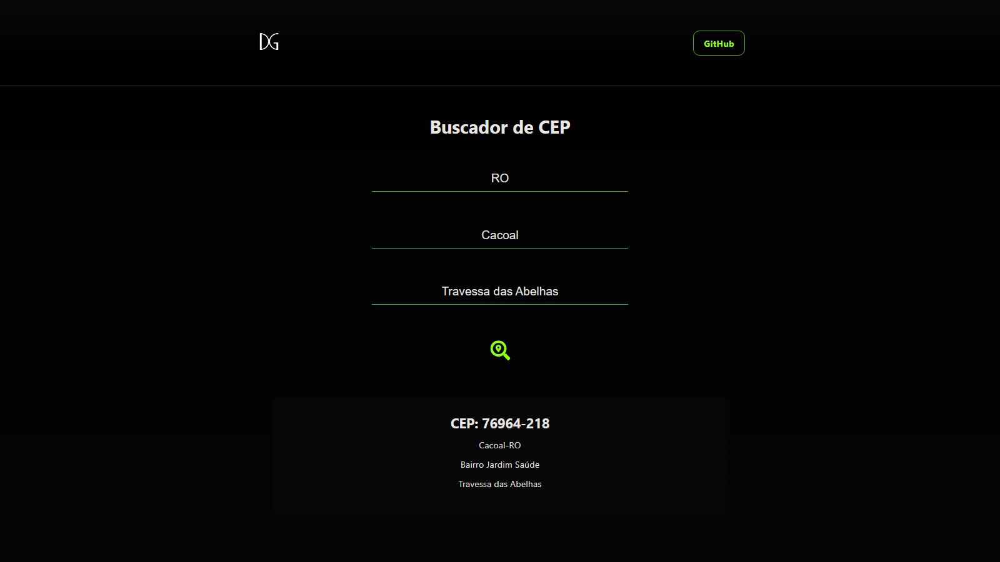
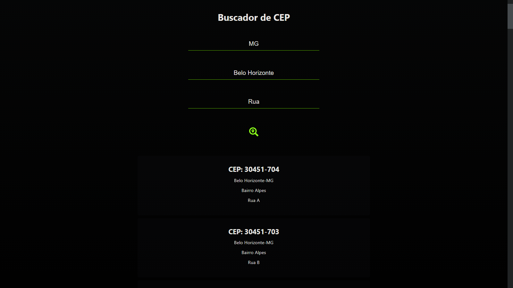

# CEP Find SPA

Um app que realiza uma request na API [ViaCEp](https://viacep.com.br/) trazendo o endereço completo com o número do CEP.
Projeto de estudo focado principalmente em lidar com requests e responses de uma API de terceiros.

Para a realizar a requisição na API utilizo de um formulário usando o [Formik](https://formik.org/) e o [YUP](https://www.npmjs.com/package/yup) para realizar as verificações e retornar os erros ao usuário.

Utilizo também do [React Icons](https://react-icons.github.io/react-icons/) usando ícones do [Font Awesome](https://fontawesome.com/).

## Imagens

